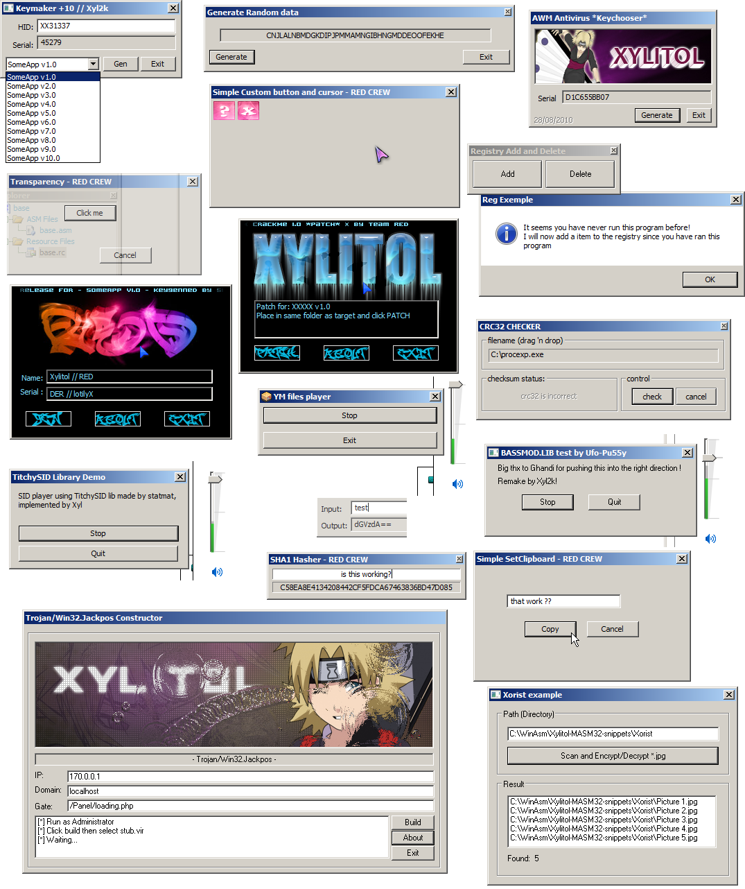

MASM32 Code collection for reverse engineers
=======================

This repository contain various snippets to help you to make your own release and more.<br />
See also [here](https://github.com/Xyl2k/MASM32-graphical-effects) for graphical effects.<br />
WinASM friendly, codes can be compiled also from their respective ```make.bat``` if you don't want to launch your favorite IDE.<br />
